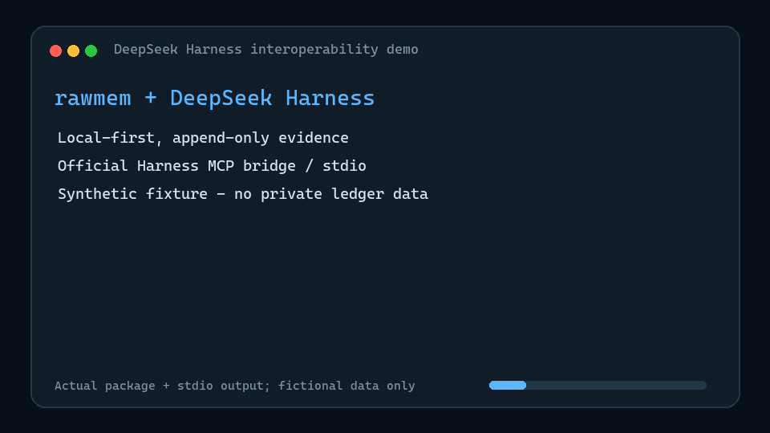

# DeepSeek Harness integration

`rawmem` integrates with DeepSeek Harness in two independent directions:

1. the daemon passively captures new Harness session evidence; and
2. Harness can query the ledger through a bounded, read-only MCP server.

Neither path turns evidence into reviewed or approved memory.

## Install the optional capabilities

```powershell
python -m pip install "rawmem[deepseek-harness,mcp] @ https://github.com/Liyuan1992/rawmem/releases/download/v0.7.0/rawmem-0.7.0-py3-none-any.whl"
```

The `deepseek-harness` extra supplies the Zstandard decoder used by Harness's
default `session.jsonl.zstd` persistence. The `mcp` extra supplies the stdio
server. The rawmem core remains dependency-free when neither is selected.

## Capture Harness sessions

The `deepseek_harness` tailer is disabled by default because it is a new
background capture surface. After setting its `enabled` field to `true`, it
discovers:

```text
$DSH_HOME/sessions/**/session.jsonl.zstd
$DSH_HOME/sessions/**/session.jsonl
```

If `DSH_HOME` is unset, the root is `~/.dsh/sessions`. Override it explicitly
in `~/.rawmem/config.json` when the Harness home is elsewhere:

```json
{
  "daemon": {
    "tailers": {
      "deepseek_harness": {
        "enabled": true,
        "root": "/path/to/dsh-home/sessions",
        "include_assistant": true,
        "include_tool_metadata": true,
        "max_chars": 6000
      }
    }
  }
}
```

First run baselines existing sessions. Use `rawmem sync --backfill` only when
historical import is intentional. The tailer accepts direct user messages and
model text blocks, ignores injected plugin/goal messages and model reasoning,
and never copies tool arguments or result bodies. Tool evidence is limited to
name, call id, and success/error metadata.

## Let Harness query rawmem

DeepSeek Harness's official MCP client bridges MCP tools over stdio. The
repository ships `examples/deepseek-harness/rawmem.cordis.yml`; its standalone
overlay is:

```yaml
- insert:
    - id: memory-rawmem
      name: '@deepseek-ai/dsh-mcp-client'
      config:
        serverName: rawmem
        transport: stdio
        command: rawmem-mcp
        args: ['--scopes', 'read:summary']
        env: {}
        cwd: !!js process.cwd()
        failOnStartupError: true
```

Start a profile with the one-run overlay:

```powershell
dsh web --patch .\examples\deepseek-harness\rawmem.cordis.yml
```

The model then sees:

- `mcp__rawmem__rawmem_status`
- `mcp__rawmem__rawmem_recent`
- `mcp__rawmem__rawmem_archives`

`rawmem_recent` returns the summary projection by default and scans at most
8 MiB with at most 100 returned events. Call `rawmem_status` first when chain
integrity matters. To expose raw text deliberately, change the configured
scope to `read:summary,read:full` and request `projection: full`.

Harness currently bridges MCP tools only, so this server intentionally does
not depend on MCP resources or prompts. To keep the overlay, merge its `insert`
entry into the relevant Harness user patch; do not overwrite unrelated patch
entries.

## Reproduce the synthetic demo

The published GIF contains only fictional evidence. Run the same real MCP
stdio calls from a checkout with:

```powershell
python .\examples\deepseek-harness\demo.py
```

The script creates a disposable ledger, verifies its hash chain, reads the
summary projection, and confirms that full text fails closed under the default
scope. To re-render the 11.8-second GIF, install Pillow and run
`python .\examples\deepseek-harness\render_demo_gif.py`.



## Boundary

`rawmem` remains the raw evidence source. A separate, review-gated consumer
owns any candidate extraction, approval, or durable-memory conversion. The MCP
surface is read-only and exposes no capture, rewrite, approval, or promotion
tool.
